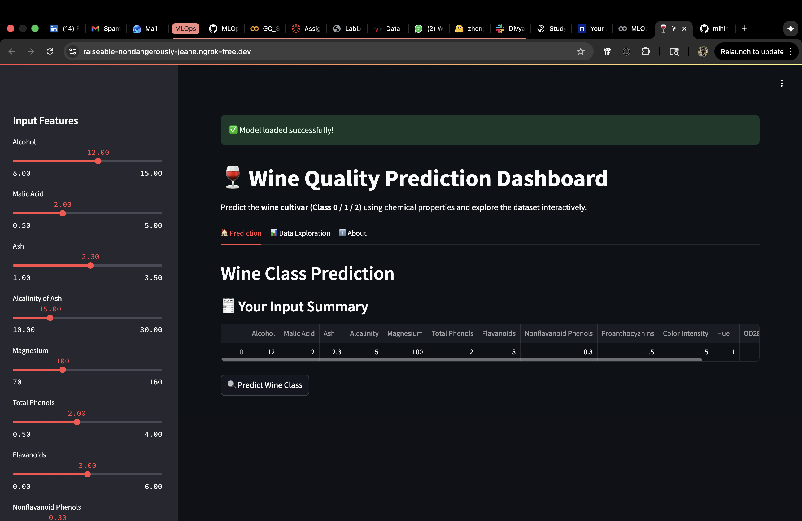
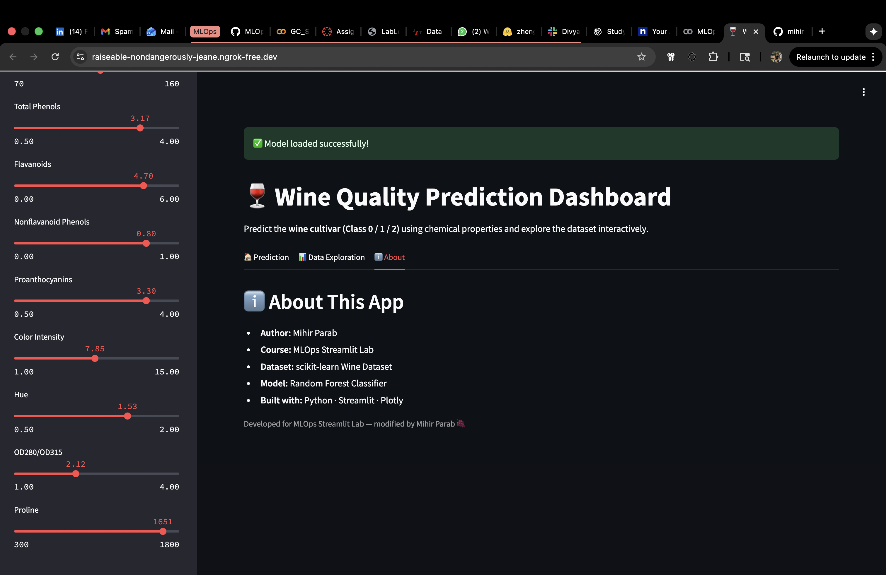
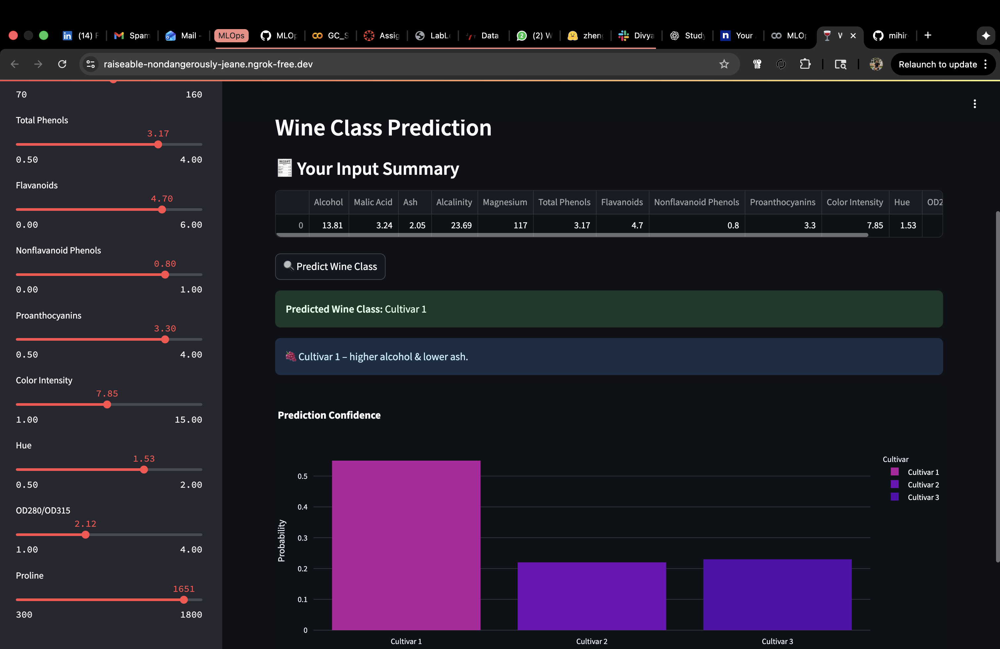
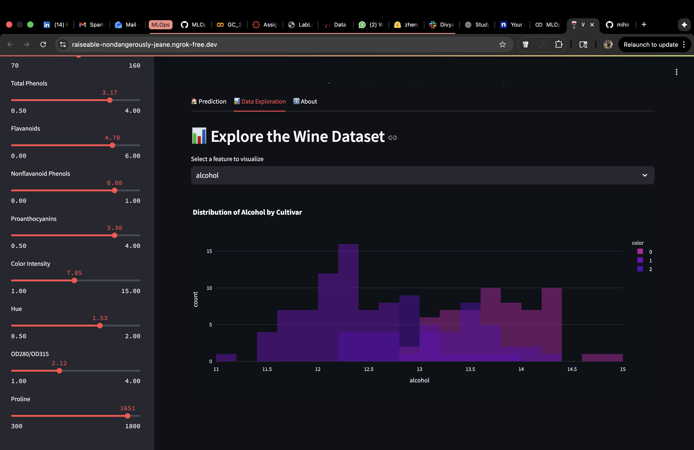

# 🍷 Wine Quality Prediction Dashboard  

An interactive **Streamlit app** that predicts the **cultivar type of wine** based on 13 chemical features such as Alcohol, Ash, Color Intensity, and Proline.  
Developed as part of the **MLOps Streamlit Lab** at Northeastern University, this project demonstrates model training, deployment, and interactive visualization using **Python, scikit-learn, and Streamlit**.

---

## 🧩 Features
- 🎛️ Interactive sliders for all 13 chemical features  
- 🤖 Real-time prediction using a trained Random Forest model  
- 🧠 Contextual insight messages for each predicted cultivar  
- 📊 Probability-based confidence chart visualization  
- 📈 Data Exploration tab for understanding feature relationships  
- ℹ️ About tab summarizing the project’s scope and workflow  
- 🧱 Built with `pandas`, `scikit-learn`, and `streamlit`

---

## 🏠 Dashboard Interface

| Dashboard Home | About Tab |
|:---------------:|:----------:|
|  |  |

The dashboard provides intuitive sliders to adjust feature values, letting users simulate chemical compositions of different wine samples.  
The sidebar offers feature configuration, while the main panel dynamically displays predictions, confidence levels, and interpretive feedback.

---

## 🔍 Prediction Workflow

The **Prediction section** is the heart of the application. It takes the user’s chosen input features and passes them to a pre-trained **Random Forest Classifier** to determine which of the three wine cultivars (Class 0, 1, or 2) the sample most likely belongs to.

| Prediction Result |
|:----------------:|
|  |

### 🧠 What Happens During Prediction
1. **Feature Input:**  
   - Users manipulate 13 sliders representing key chemical features such as Alcohol, Ash, Color Intensity, Hue, and Proline.  
   - These values are collected into a NumPy array and passed to the model.  

2. **Model Inference:**  
   - The model, trained on the Wine dataset from `sklearn.datasets`, predicts the cultivar type (Class 0, 1, or 2).  
   - It also generates probability scores for each class, showing how confident the model is about its decision.  

3. **Result Display:**  
   - The predicted class is displayed in green (✅).  
   - A **confidence bar chart** visualizes probabilities across all three classes, helping users understand model certainty.  
   - Below the chart, an **interpretation message** explains the likely flavor or characteristic profile of the predicted cultivar, such as:  
     > “🍇 This wine likely belongs to Cultivar 1, characterized by higher alcohol and lower ash content.”  

4. **Educational Value:**  
   - This setup helps students and practitioners visually grasp how minor changes in chemical composition affect the model’s classification outcomes.

---

## 📊 Data Exploration Tab

The **📊 Data Exploration** tab allows users to visually analyze relationships between different features of the Wine dataset — for example, how alcohol correlates with color intensity or proline levels.  
It also displays summary statistics and helps interpret feature importance for the prediction model.

| Data Exploration View |
|:----------------------:|
|  |

---

## ⚙️ How to Run

### 🪄 Option 1 — Run in Colab
1. Clone the repo  
   ```bash
   !git clone https://github.com/mihir-parab30/MLOps_Streamlit_Lab.git
   cd MLOps_Streamlit_Lab
